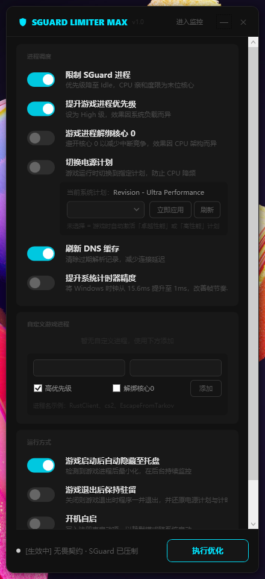

# SGuard Limiter Max


**自动检测游戏启动，一键完成系统级性能调优。**
A lightweight Windows utility that automatically applies OS-level performance optimizations when a monitored game is detected.



---

## 功能介绍 / Features

| 功能 | 说明 |
|---|---|
| **限制 SGuard 进程** | 将 `SGuard64` / `SGuardSvc64` 设为最低优先级并限定在单个 CPU 核心，释放其他核心给游戏 |
| **提升游戏进程优先级** | 将游戏进程提升至"高"优先级，使操作系统优先调度游戏 |
| **解绑 CPU 0 核心** | 将游戏进程从 CPU 0 上移除，避免系统中断占用（可选，效果因 CPU 架构而异） |
| **切换电源计划** | 游戏启动时自动切换至指定电源计划，退出后自动还原；可从系统现有计划列表中选择目标计划 |
| **刷新 DNS 缓存** | 游戏启动时执行 `ipconfig /flushdns`，清除过期 DNS 记录以降低首次连接延迟 |
| **提升系统计时器精度** | 将 Windows 定时器精度从默认 15.6ms 提升至 1ms，改善帧时序和输入响应一致性 |
| **自定义游戏进程** | 手动添加任意游戏进程名，独立配置优先级提升和 CPU 0 解绑策略 |
| **游戏退出托盘通知** | 游戏退出后发送系统通知，告知优化已还原 |
| **检测到游戏自动进入托盘** | 游戏启动后主界面自动最小化至系统托盘，后台静默运行 |
| **游戏退出后继续监控** | 保持驻留等待下次游戏启动（默认关闭，即游戏退出后程序自动结束） |
| **开机自动启动** | 注册至 `HKCU\...\Run`，以 `--autostart` 模式静默启动（不显示主界面） |

默认开启：限制 SGuard、提升游戏进程优先级、刷新 DNS 缓存。

---

## 系统要求 / Requirements

- **操作系统**：Windows 10 / 11（x64）
- **权限**：需要以**管理员身份**运行（修改进程优先级和电源计划必须）
- **内置支持游戏**：VALORANT（无畏契约）、Delta Force（三角洲行动）；其他游戏可通过"自定义游戏进程"添加

---

## 下载 / Download

前往 [Releases](../../releases) 页面，根据情况选择版本：

| 文件 | 大小 | 说明 |
|---|---|---|
| `SGuardLimiterMax_standalone.exe` | ~70 MB | **推荐**：自带运行时，开箱即用 |
| `SGuardLimiterMax_framework.exe` | ~2 MB | 需要已安装 [.NET 8.0 Desktop Runtime](https://dotnet.microsoft.com/download/dotnet/8.0) |

> 不确定自己有没有装 .NET 8？下载 standalone 版本即可。

---

## 快速开始 / Quick Start

1. 下载上方对应版本的 exe
2. 右键选择"以管理员身份运行"
3. 根据需要开启或关闭各项功能，点击"保存配置"
4. 点击"进入监控"——程序最小化至托盘，等待游戏启动
5. 启动游戏，优化自动生效；退出游戏，所有系统设置自动还原

> 配置文件 `Config.json` 保存在程序同目录下，便携无需安装。

---

## 技术原理 / How It Works

> 本节供开发者参考。软件仅使用 Windows 公开 API，无任何代码注入或内核驱动。

### 架构

```
MainWindow (WPF, WindowStyle=None)
└── MainViewModel          # MVVM ViewModel，3 秒轮询后台检测循环
    ├── ProcessOptimizer   # 进程优先级 & CPU 亲和性（内置 + 自定义游戏）
    ├── PowerManager       # 电源计划查询/切换 & DNS 刷新
    ├── TimerResolutionService  # WinMM 计时器精度
    ├── StartupManager     # 注册表自启
    └── ConfigManager      # Config.json 读写
```

### 各模块实现

**ProcessOptimizer** — `Services/ProcessOptimizer.cs`
使用 .NET `System.Diagnostics.Process` API 修改进程调度属性：
```csharp
proc.PriorityClass = ProcessPriorityClass.Idle;
proc.ProcessorAffinity = (nint)(1 << lastCoreIndex);  // 限定末尾核心
```
内置游戏使用全局标志；自定义游戏（`CustomGameEntry`）各自独立配置。

**PowerManager** — `Services/PowerManager.cs`
通过 `powercfg /list` 查询系统所有电源计划，`powercfg /setactive {GUID}` 切换，`ipconfig /flushdns` 刷新 DNS。支持用户从列表中指定目标计划，未指定时自动选择卓越性能或高性能。

**TimerResolutionService** — `Services/TimerResolutionService.cs`
P/Invoke 调用 `winmm.dll`：
```csharp
[DllImport("winmm.dll")] static extern uint timeBeginPeriod(uint uPeriod);
[DllImport("winmm.dll")] static extern uint timeEndPeriod(uint uPeriod);
```
启用：`timeBeginPeriod(1)`；退出时：`timeEndPeriod(1)` 还原。

**StartupManager** — `Services/StartupManager.cs`
读写 `HKCU\Software\Microsoft\Windows\CurrentVersion\Run`，每次启动时同步注册表路径，确保移动 exe 后自启仍有效。

**ConfigManager** — `Services/ConfigManager.cs`
`System.Text.Json` 序列化/反序列化 `AppConfig`，配置文件与 exe 同目录，完全便携。

### 构建 / Build

```powershell
# 同时生成 standalone 和 framework 两个版本
.\build.ps1

# 或直接双击
build.bat
```

输出目录：`publish\standalone\` 和 `publish\framework\`，均为单个可执行文件。

---

## 免责声明 / Disclaimer

- 本软件**不注入代码**、**不修改游戏文件**、**不读取游戏内存**，仅通过 Windows 公开 API 调整系统级调度参数。
- 使用本软件**可能违反 VALORANT、Delta Force 等游戏的用户协议（ToS）**，由此产生的封号或其他后果由用户自行承担，开发者不负任何责任。
- 本项目与 Riot Games、腾讯、TiMi Studio Group 及任何反作弊厂商**无任何关联**，亦未获得其授权。
- 本软件按"**原样**"提供，不附带任何明示或暗示的保证。

---

## License

[MIT](LICENSE) © 2026 SGuardLimiterMax Contributors
